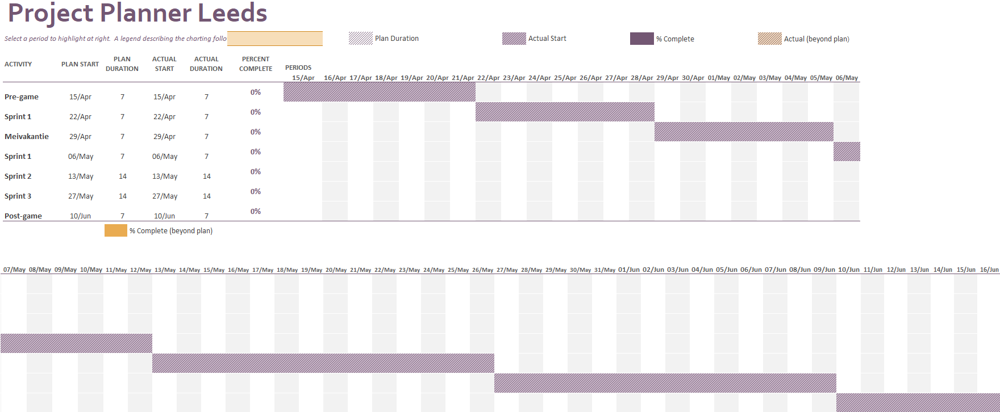

# Plan van aanpak projectgroep Coati

## Inhoudsopgave

[Inleiding](#inleiding)

- Doel van het document

- Introductie van de opdracht

- Leeswijzer

1 [Achtergrond van het project](#1-achtergrond-van-het-project)

- 1.1 Beschrijving organisatie

- 1.2 Belanghebbenden

- 1.3 Aanleiding voor het project

2 [Doelstelling, opdracht en op te leveren resultaten voor het bedrijf](#2-doelstelling-opdracht-en-op-te-leveren-resultaten-voor-het-bedrijf)

- 2.1 Probleemstelling

- 2.2 Doelstelling

- 2.3 Opdracht

3 [Projectgrenzen](#3-projectgrenzen)

- 3.1 Binnen de scope

- 3.2 Buiten de scope

4 [Randvoorwaarden](#4-randvoorwaarden)

- 4.1 Technische randvoorwaarden

- 4.2 Randvoorwaarden tijd en geld

- 4.3 Randvoorwaarden vooraf

5 [Op te leveren producten en kwaliteitseisen](#5-op-te-leveren-producten-en-kwaliteitseisen)

- 5.1 Betreft het ideeënboard

- 5.1.1 Plan van aanpak

- 5.1.2 Software guidebook

- 5.2 Betreft de HAN

- 5.2.1 Persoonlijk verslag

- 5.3 Kwaliteitseisen

6 [Ontwikkelmethode](#6-ontwikkelmethode)

7 [Projectorganisatie en communicatie](#7-projectorganisatie-en-communicatie)

- 7.1 Betrokkenen bij het project

- 7.2 Contactmomenten

- 7.3 Contactmiddelen

- 7.4 Groepsafspraken

- 7.5 Rollen binnen de projectgroep

8 [Planning](#8-planning)

9 [Risico's](#9-risicos)

## Inleiding

### Doel van het document

Voor het DWA-Project hebben wij als opdracht gekregen om een ideeën bord te maken voor Schiphol medewerkers. De ideeën worden op verschillende grote schermen getoond. Bij de ideeën staat de titel van het idee en de upvotes staan ernaast. Ook staat er een korte beschrijving van het idee onder de titel. Onderaan staat een QR-code waarmee je de mogelijkheid hebt om via een mobiele applicatie een idee te plaatsen of om te stemmen.

### Introductie van de opdracht

De opdracht die we dus hebben is om dus een ideeën bord te maken. Om dit te bereiken hebben we een voorbereiding nodig. Dit document dient als voorbereiding voor de ideeën bord applicatie. Een andere functie van dit document is, het op de hoogte houden van de opdrachtgever.

### Leeswijzer

In hoofdstuk 1 wordt de achtergrond van het project verduidelijkt. De doelstelling, opdracht en op te leveren resultaten voor het bedrijf wordt in hoofdstuk 2 toegelicht. Projectgrenzen worden duidelijk gemaakt in hoofdstuk 3. In hoofdstuk 4 wordt de randvoorwaarden gegeven. In hoofdstuk 5 worden de op te leveren producten en kwaliteitseisen behandeld. In hoofdstuk 6 wordt de beste ontwikkelmethode gegeven om het project te realiseren. In hoofdstuk 7 staat de projectorganisatie en communicatie in. In hoofdstuk 8 wordt de planning weergegeven in een GANTT chart. De risico&#39;s die er kunnen voorkomen worden in hoofdstuk 9 gerealiseerd.

## 1 Achtergrond van het project

In dit hoofdstuk zal worden beschreven wie de opdrachtgever van de applicatie is, wie de verdere belanghebbenden bij de opdracht zijn en wat de aanleiding was voor de opdrachtgever om deze opdracht te starten.

### 1.1 Beschrijving organisatie

De HAN University of Applied Sciences is een school die investeert in het onderwijs en onderzoek. Hierbij wordt er gericht om mensen op te laten groeien als professional en als persoon. De samenwerking tussen onderwijs, beroepenveld, onderzoek is dus een belangrijk aandachtspunt. De HAN wil dus zorgen voor een veelzeggende toekomst.

### 1.2 Belanghebbenden

De medewerkers van Schiphol hebben belang deze opdracht. Zij bekijken de ideeën en hebben de mogelijkheid om een idee te upvoten. Ook hebben zij de mogelijkheid om zelf een idee te plaatsen. Door middel van goede ideeën kunnen zij verandering aanbrengen op de werkvloer.

### 1.3 Aanleiding voor het project

De aanleiding voor het project is dat werknemers graag een plek willen om hun ideeën te plaatsen. Hierbij willen ze de beste ideeën eruit filteren. Dit willen ze realiseren door middel van een upvoting systeem. Er is geen urgentie bij het realiseren van het project. Er zijn namelijk een aantal beeldschermen beschikbaar die niet gebruikt worden.

## 2 Doelstelling, opdracht en op te leveren resultaten voor het bedrijf

In dit hoofdstuk wordt gekeken naar het probleem waar de werknemers bij Schiphol mee zitten. Zodra we een beeld hebben van het probleem wordt de doelstelling bepaald. Op basis van de doelstelling wordt onze opdracht geformuleerd. Tenslotte gaan we kijken naar de resultaten die we op gaan leveren.

## 2.1 Probleemstelling

Het probleem van Schiphol is als volgt: de werknemers van diverse kantoren van Schiphol hebben geen medium om ideeën te delen die deze kantoren beter zouden kunnen maken.

### 2.2 Doelstelling

De doelstelling van het project is om medewerkers van Schiphol een medium te geven waarop hun ideeën gedeeld kunnen worden.

### 2.3 Opdracht

Om de doelstelling te halen gaat de groep een applicatie ontwikkelen waarop werknemers van Schiphol zich kunnen registreren, inloggen en hun ideeën zowel als hun meningen hierover kunnen delen d.m.v. stemmen en/of reacties. Deze worden vervolgens geordend op populariteit. 

## 3 Projectgrenzen

Het project zal bestaan uit drie sprints, dus totaal zal het 6 weken duren. Vanwege deze beperkte duur zullen we waarschijnlijk niet in staat zijn om alle mogelijke functionaliteiten te implementeren.  Daarom hebben we projectgrenzen opgesteld die gelden voor de afgesproken duur van het project.  De op te leveren producten zijn onder te verdelen in producten die binnen de scope van het project vallen en producten die buiten de scope van het project vallen

### 3.1 Tijdsduur

Het project 'IdeaBoard' gaat 15 April van start en zal duren tot 16 Juni.

### 3.2 Binnen de scope

- Een realtime ideeënbord applicatie bouwen
- Een database waarin alle gegevens opgeslagen en opgehaald kunnen worden voor de applicatie
- Alle op te leveren documenten voor het project:
  - Plan van Aanpak
  - Documentatie (met verhelderende modellen en diagrammen)
  - Broncode
  - Testcode
  - Persoonlijke onderzoeken
  - Logboek

### 3.3 Buiten de scope

- Ondersteuning voor het draaien van de webserver op andere systemen dan Microsoft Windows 10.
- Ondersteuning voor het draaien van de applicatie aan de gebruikerszijde buiten de browser of een progressive web app (PWA).
- De API is compatibel met meerdere soorten databases.
- Na het einde van het project hoeven we geen ondersteuning meer te leveren voor het eindproduct.

## 4 Randvoorwaarden

In dit hoofdstuk worden de randvoorwaarden behandeld. Dit zijn de zaken die door anderen voor ons geregeld moeten zijn zodat we vlot kunnen doorwerken.

- De HAN dient ruimtes beschikbaar te hebben met stroomvoorziening en een goed werkende netwerkverbinding, het is aan de groep zelf om deze te vinden.
- De vijf projectleden werken gemiddeld 40 uur per week aan het project, gedurende 7 weken.
- De opdrachtgever dient minimaal één keer per twee weken beschikbaar te zijn voor de sprintreview en daarnaast is hij ook beschikbaar via email om vragen te beantwoorden.
- De groepsleden dienen de juiste programma&#39;s en modules geïnstalleerd te hebben om aan de slag te kunnen.

## 5 Op te leveren producten en kwaliteitseisen

Hieronder staan alle op te leveren producten beschreven. Dit zijn de producten die moeten worden opgeleverd aan de opdrachtgever en aan school. De producten zijn eerst beschreven, daarna zijn ze in de tabel toegevoegd.

- Plan van Aanpak
- Software Guidebook
- Broncode
- Eindpresentatie
- Logboek

### 5.1 Betreft het IdeaBoard

#### 5.1.1 Plan van aanpak

In het Plan van Aanpak komt het projectplan te staan. Dit wordt voorafgaand aan het project geschreven om goed na te denken hoe het project aangepakt moet worden. De hoofdstukken worden eerst door elk groepslid individueel gemaakt, waarna het later toegevoegd wordt om het definitieve Plan van Aanpak te maken.

#### 5.1.2 Software guidebook

In het software guidebook staat alle informatie die nuttig is voor software engineers buiten het team die het product moeten onderhouden of uitbreiden.

### 5.2 Betreft de HAN

#### 5.2.1 Persoonlijk verslag

Ieder groepslid maakt een persoonlijk verslag. Dit is een individueel verslag waarin ieder teamlid zijn bijdrage aan het project verantwoordt. Ook kan hij hier zijn persoonlijke leerdoelen beschrijven.

### 5.3 Kwaliteitseisen

In onderstaande tabel staat voor ieder product beschreven wat de productkwaliteitseisen zijn, wat de benodigde activiteiten zijn om tot het product te komen

| Product | Productkwaliteit eisen | Benodigde activiteiten om te komen tot het product | Proceskwaliteit |
| --- | --- | --- | --- |
| Plan van aanpak | Moet voldoen aan de ICA-controlekaart. Moet voldoen aan de eisen van het bestand 'Toelichting op PvA 3.0'. Moet accuraat alle informatie omtrent het project weergeven. | Informatie uit de casus opdoen. Gesprek voeren met de Product owner. Hoofdstukken verdelen onder projectleden. | Feedback vragen aan de professional skills docent en deze implementeren. Per hoofdstuk een projectlid aanwijzen die het hoofdstuk controleert. |
| Software guidebook | Moet voldoen aan de ICA-controlekaart | Informatie uit de casus opdoen. Gesprek voeren met de Product owner | Feedback vragen aan de professional skills docent en deze implementeren. |
| Broncode | 80% unit test coverage. Codering in het Engels. Implementatie wordt gedocumenteerd. | Schrijven code. | Code reviewen. Gemaakte code regelmatig pushen zodat het up-to-date blijft. |
| Eindpresentatie | Goede representatie van proces en eindkwaliteit. | Inventarisatie nodige onderdelen. Verdelen van taken. | Presentatie oefenen |
| Logboek | In het logboek is aangetoond welke werkzaamheden je hebt verricht. | Bijhouden welke werkzaamheden je verricht. | Regelmatig werkzaamheden noteren. |
| Persoonlijk verslag | Moet voldoen aan de ICA-controlekaart | Elke week een aantal uren vrijmaken om aan het persoonlijk verslag te werken. Elke dag tijd vrijmaken om het logboek te updaten. | Gekregen feedback verwerken in het document. |

## 6 Ontwikkelmethode

De ontwikkelmethode die het ontwikkelteam gaat gebruiken gedurende het Idea Board project is Scrum.

De bedoeling van Scrum is door middel van werken in teamverband op een flexibele manier producten te ontwikkelen. Er wordt binnen de Scrum gebruik gemaakt van een Scrum Master. Deze begeleidt het team door ervoor te zorgen dat de taken goed ingedeeld zijn en iedereen verantwoordelijkheid draagt voor zijn/haar taken. Ook is de Scrum Master verantwoordelijk voor het houden van de daily stand-up aan het begin van elke werkdag.

Tijdens de daily standup wordt er maximaal een kwartier gepraat over welke werkzaamheden er verricht zijn, welke er op de planning staan en welke obstakels er verwacht worden. Op deze manier wordt er nauw samengewerkt en kennis uitgewisseld. Ten slotte wordt er besproken of de voortgang van de sprint in gevaar komt. Dit is waar de daily standup uiteindelijk om gaat.

De Product Owner (PO) of de klant is de opdrachtgever. De PO beheert de Product Backlog (PB). In de PB staat het overzicht van de taken die nog uitgevoerd moeten worden.

Het ontwikkelteam maakt d.m.v. deze lijst een planning. In deze planning wordt weergegeven hoeveel tijd er nodig voor is.

Met Scrum werken we in periodes van 2 weken (Sprints). De PO bepaald voor iedere sprint wat de prioriteiten zijn. Deze prioriteiten worden vanuit de PB verplaatst naar de Sprint Backlog (SB). Deze taken moeten binnen deze 2 weken afgerond zijn. Wanneer een taak niet afgerond is wordt deze verplaatst naar de PB.

Na elke sprint wordt er een Retrospective gehouden. Bij de Retrospective wordt er teruggekeken op het functioneren van het Scrumteam zelf. Hierbij worden er verbeterpunten opgenomen die in de volgende sprint worden behandeld. De Sprint Review wordt gehouden na de Retrospective zodat eventueel besproken onderwerken gelijk gecommuniceerd kunnen worden naar de PO. Tijdens de Sprint Review wordt er teruggekeken naar wat er behaald is en waar nodig is de PO aan te passen.

Ten slotte heeft het ontwikkelteam ook IPV-momenten. Om onszelf te verbeteren en het aantonen van de competenties houden wij na elke sprint een feedbacksessie. Bij deze sessie geven we elkaar opbouwende kritiek.

## 7 Projectorganisatie en communicatie

In dit hoofdstuk zult u lezen wie de betrokkenen van dit project zijn, wat de contactmomenten met de betrokkenen zullen zijn, welke middelen er gebruikt worden om contact op te nemen met de betrokkenen, wat de werktijden van de projectgroep tijdens dit project zijn, welke rollen er te onderscheiden vallen binnen de projectgroep en welke afspraken er binnen de groep gemaakt zijn.

### 7.1 Betrokkenen bij het project

In dit project zijn de projectgroep, de product owner, de procescoach en de professional skills docent betrokken. De betrokkenen staan hieronder in de tabel inclusief de contactgegevens:

| **Rol** | **Naam** | **Studentnummer** | **Contactgegevens** |
| --- | --- | :---: | --- |
| Student | Jaimy Heezen | 609228 | E-mail: [J.Heezen1@student.han.nl](mailto:J.Heezen1@student.han.nl) Telefoon: 06 34 83 49 06 |
|  | Tim Maas Geesteranus | 597842 | [TME.MaasGeesteranus@student.han.nl](mailto:TME.MaasGeesteranus@student.han.nl) Telefoon: 06 22 33 74 84 |
|  | Lotus ter Haar | 579228 | [LA.terHaar@student.han.nl](mailto:LA.terHaar@student.han.nl) Telefoon: 06 44 06 17 36 |
|  | Botan Abak | 567752 | [B.Abak@student.han.nl](mailto:B.Abak@student.han.nl) Telefoon: 06 40 77 85 17 |
|  | Daan Bardoel | 598142 | [D.Bardoel@student.han.nl](mailto:D.Bardoel@student.han.nl) Telefoon: 06 29 34 89 47 |
| Professional skills docent | Peter Schulz |   | [Peter.Schulz@han.nl](mailto:Peter.Schulz@han.nl) |
| Product owner | Fritz van Deventer |   | [Fritz.VanDeventer@han.nl](mailto:Fritz.VanDeventer@han.nl) |
| Procesbegeleider | Lars Tijsma |   | [Lars.Tijsma@han.nl](mailto:Lars.Tijsma@han.nl) |

### 7.2 Contactmomenten

| **Onderwerp** | **Betrokkenen** | **Tijdstip** |
| --- | --- | --- |
| Daily stand up | Projectteam | Iedere werkdag om 08:30 |
| Retrospective | Projectteam en procesbegeleider | Iedere dinsdag in de ochtend |
| Bespreking over leerdoelen | Projectteam en skills docent | Iedere woensdag van 15:15 tot 16:45 |
| Sprint planning | Projectteam en product owner | Normaliter eerste maandag van een sprint. Eerste sprint de donderdag voor de sprint (17 april 2019) om 12:15 tot 13:15 |
| Sprint review | Projectteam en product owner | Laatste vrijdag van de sprint |

### 7.3 Contactmiddelen

De groep gebruikt voor onderling contact een WhatsApp-groep om met elkaar te communiceren. Om met de product owner, professional skills docent en procesbegeleider te communiceren, wordt er gebruik gemaakt van de mail. Bij iedere afspraak met de product owner, professional skills docent en procesbegeleider, dient er minimaal 48 uur van tevoren door de projectgroep een mail gestuurd zijn om de afspraak plaats te laten vinden.

### 7.4 Groepsafspraken

- De werktijden van de projectgroep zijn iedere werkdag (maandag t/m vrijdag) van 8:30 tot 16:30.
- Wanneer iemand te laat komt, dient hij/zij dit via de groepsapp te communiceren met de rest van de groep.
- Ieder groepslid mag maximaal een uur per dag pauze houden.
- Bij ziekte dient de zieke zich voor 10:00 ziek te melden op de dag vanaf het ziekmelden.
- Wanneer iemand weer beter is, dan meldt de persoon dat op de dag waarop hij/zij weer aanwezig gaat zijn voor het begin van de werkdag of op de dag voor de dag waarop het groepslid weer aanwezig zal zijn.
- Voordat iemand pauze gaat houden en aan het einde van de dag laat die persoon weten wat hij/zij aan vooruitgang tot die tijd geboekt heeft
- Wanneer iemand vastloopt met een taak, dan dient hij/zij dat binnen een uur vanaf het vastlopen te melden, zodat groepsleden daar ondersteuning op kunnen bieden.
- Het is niet de bedoeling om tijdens meetings, presentaties of de daily stand-up de laptop opengeklapt te hebben of de telefoon actief te gebruiken, tenzij dit nodig is om een taak uit te voeren. Dit om te voorkomen dat iemand niet goed zijn/haar aandacht bij het gesprek te houden.

### 7.5 Rollen binnen de projectgroep

Binnen de projectgroep zijn er drie rollen te onderscheiden. Deze rollen zijn: groepslid, notulist en scrummaster. Het groepslid heeft als taak om bij de daily stand-up de taken die hij/zij gaat doen uit te voeren en actief aanwezig te zijn tijdens meetings. De notulist heeft als verantwoordelijkheid om belangrijke zaken tijdens een project te notuleren. De scrummaster heeft de verantwoordelijkheid om iedere dag de daily stand-up te leiden en de review meeting te leiden.

## 8 Planning

Hieronder is onze planning zichtbaar. Zoals te zien zijn er drie sprints, die elk twee weken duren. De eerste sprint wordt onderbroken door de meivakantie. Voor we met de sprints beginnen is er eerst een Pre-game. Hierin zorgen we dat de opdracht voor iedereen duidelijk is. Het project wordt afgesloten met de post-game.

planning 1

## 9 Risico&#39;s

In dit hoofdstuk worden de risico&#39;s besproken. Onder een risico verstaan we iets wat buiten onze macht/invloed kan optreden, en als het optreedt dan wordt de doelstelling van het project niet behaald. Alleen de risico&#39;s die we vooraf niet kunt beïnvloeden zijn opgenomen in de onderstaande tabel.

| **Risico** | **Kans (groot-middel-klein)** | **Impact(groot-middel-klein)** | **Tegenmaatregel** | **Uitwijkingstrategie** |
| --- | --- | --- | --- | --- |
| Geen ruimtes beschikbaar | middel | groot | Op andere locatie of thuis werken | Ruim van tevoren lokalen reserveren via han.insite |
| De nodige programma's zijn niet beschikbaar | middel | middel | Licentie voor vragen of zoeken naar alternatieven | Voor de start van het project controleren of deze beschikbaar zijn |
| Verlies van bestanden | middel | groot | Continu back-ups maken, bestanden online bewaren (met bijv. Github en Onedrive) |   |
| Communicatie met de Product Owner verloopt minder goed | middel | middel | Duidelijke, concrete vragen stellen aan de Product Owner, duidelijke afspraken maken |  |
| Crashen van Laptop | klein | groot | Externe back-ups maken, bestanden online bewaren | Vervangende laptop regelen |
| Verloren werk door afwezigheid van groepsgenoot | middel | groot |  | Product Owner op tijd inlichten. Planning bijhouden. Elke dag pushen naar Github. |
| Onderschatting benodigde tijd voor taken | groot | middel | Tijdens de daily stand-up en door de dag heen duidelijk naar elkaar communiceren welke taken af zijn en waar problemen optreden bij het uitvoeren van de taken | Bepaalde taken schrappen, of taken meenemen bij de volgende sprint |

